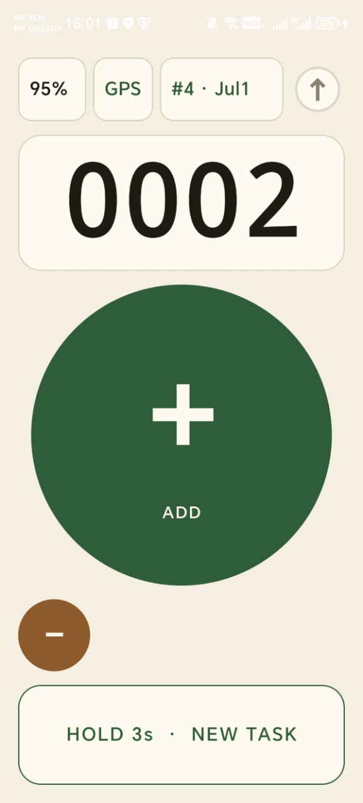
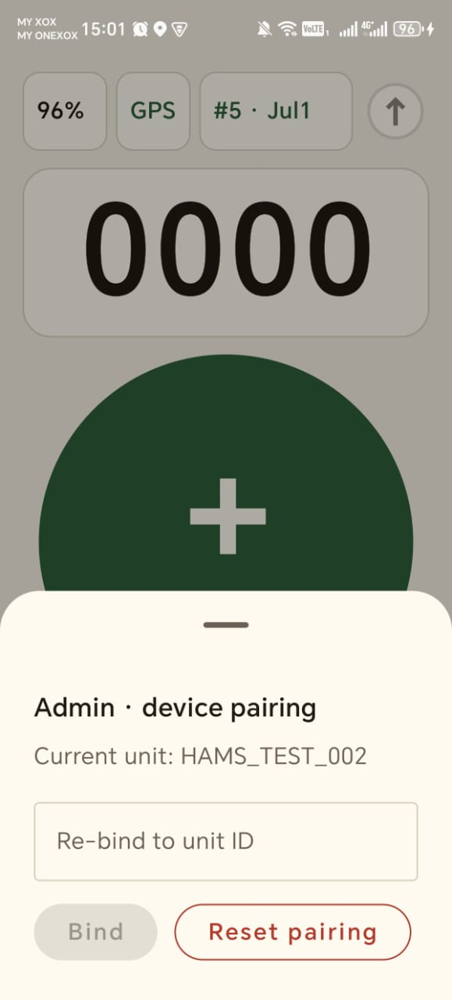
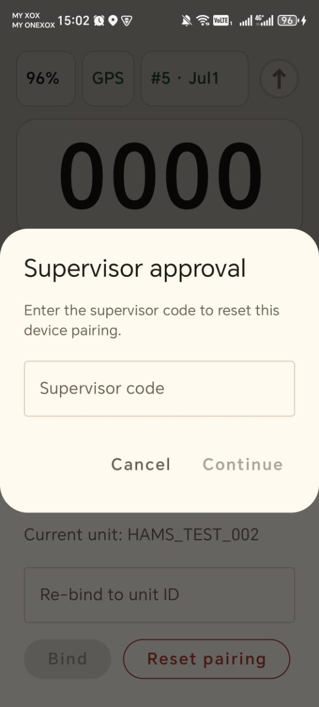
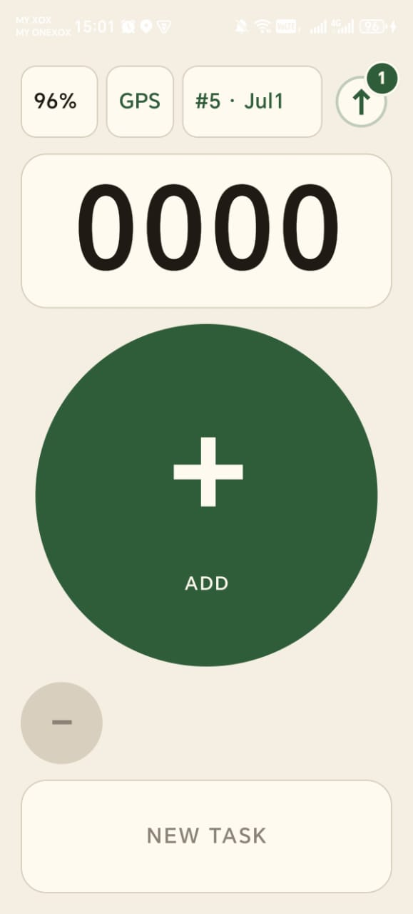
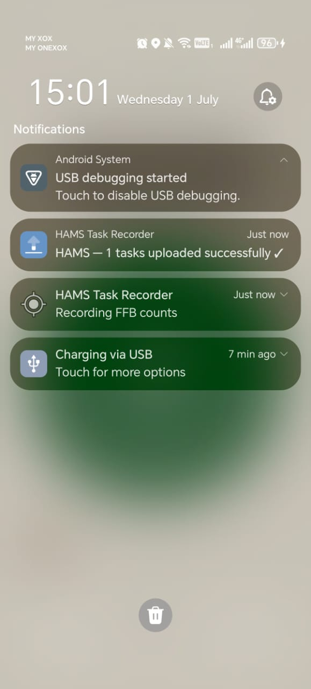

# HAMS Task Recorder — Setup Guide

End-to-end walkthrough: from a fresh clone/zip to a paired phone pushing real cuts to Wialon.
Follow the sections **in order**. Each one opens with a **✅ Prerequisites** box — finish those
before starting the section.

- Navigation & document list: [README.md](README.md)
- Backend build detail: [provisioning/BUILD_ADMIN_BACKEND.md](provisioning/BUILD_ADMIN_BACKEND.md)
- Values & contracts cheat sheet: [CONFIG_REFERENCE.md](CONFIG_REFERENCE.md)

> **No hardcoding.** You never edit source (`.kt`) files. All configuration goes into
> `local.properties` (copied from `local.properties.example`) and the n8n credential fields.
> 🔴 marks a value you must supply yourself; 🟢 marks a preset shared-platform value (info only).

---

## 1. Get the code and configure

> ### ✅ Prerequisites
> - **JDK 17** installed (`java -version` shows 17).
> - **Android SDK** installed (Android Studio or command-line tools).
> - 🔴 Your **Wialon token** ready (from your Wialon account — see [README credentials](README.md#-credentials--platform-access)).

1. Unzip / clone the repo. Work from the repo root.
2. Copy the template — do not edit source to set values:
   ```
   copy local.properties.example local.properties      # Windows
   # cp local.properties.example local.properties       # macOS/Linux
   ```
3. Open `local.properties` and fill it in:

   | Key | Fill with | Kind |
   |---|---|---|
   | `sdk.dir` | your Android SDK path, e.g. `C:\\Users\\<you>\\AppData\\Local\\Android\\Sdk` | 🔴 yours |
   | `WIALON_TOKEN` | your 72-char Wialon API token | 🔴 yours (secret) |
   | `HAMS_CLAIM_SECRET` | any strong string you invent (reused on the n8n side later) | 🔴 yours (secret) |
   | `DEVICE_UNIQUE_ID` | a dev fallback unit id, e.g. `HAMS_TEST_001` (ignored once a phone is paired) | 🔴 yours |
   | `MANUAL_CLAIM_URL` / `RELEASE_URL` | leave blank for now — set in §5 once your n8n is exposed | 🔴 yours |
   | `IPS_HOST` / `IPS_PORT` | already `185.213.1.24` / `20332` — leave as-is unless your Wialon account is on another server | 🟢 preset |

> 🔴 **Security:** `local.properties` holds live secrets. It is gitignored — keep it that way. Never
> commit it and never include it in a zip you share; hand over `local.properties.example` instead.

---

## 2. Build and install the app

> ### ✅ Prerequisites
> - §1 complete (`local.properties` filled).
> - A device or emulator connected — `adb devices` lists it.

From the repo root:
```
.\gradlew.bat :app:assembleDebug      # build debug APK -> app/build/outputs/apk/debug/
.\gradlew.bat :app:installDebug       # install on the connected device
```

Pre-grant runtime permissions so the GPS gate doesn't block you:
```
adb shell pm grant com.klk.hams.debug android.permission.ACCESS_FINE_LOCATION
adb shell pm grant com.klk.hams.debug android.permission.ACCESS_COARSE_LOCATION
adb shell pm grant com.klk.hams.debug android.permission.POST_NOTIFICATIONS
```

Make sure device **Location services are ON** (`adb shell settings get secure location_mode` returns
non-zero). The app closes on launch if location permission is denied or services are off.

> The app now runs but shows the **PairingScreen** — it can't record cuts until it's paired (§6),
> which needs the backend (§3) and a configured Wialon unit (§5).

---

## 3. Stand up the provisioning backend (n8n + Postgres)

> ### ✅ Prerequisites
> - **Docker Desktop** installed and running.
> - 🔴 A **Postgres database** — your own [Neon](https://neon.tech) project *or* a local
>   `postgres:16` container. You will need its connection string (`PROV_DB_URL`, contains a password).
> - **`psql`** client installed.
> - 🔴 The **`HAMS_CLAIM_SECRET`** you chose in §1 (you'll enter the same value on the n8n side).

The full, node-by-node procedure — apply the SQL, run n8n, import/build the 4 workflows, set the
Postgres credential, publish the webhooks, and test with `curl` — lives in its own guide:

➡️ **[provisioning/BUILD_ADMIN_BACKEND.md](provisioning/BUILD_ADMIN_BACKEND.md)**

Come back here once its §9 `curl` test returns a `200` happy-path claim. Note the base URL you'll
expose in §5 (`http://localhost:5678`, an `adb reverse` loopback, or a tunnel URL).

---

## 4. Expose n8n to the phone + point the app at it

> ### ✅ Prerequisites
> - §3 complete (webhooks published and passing the `curl` test).

`targetSdk 35` blocks plain HTTP to non-loopback hosts, so pick one path:

- **USB-tethered (simplest for a bench test):**
  ```
  adb reverse tcp:5678 tcp:5678
  ```
  Then in `local.properties` use the loopback URLs (allowed by `res/xml/network_security_config.xml`):
  ```
  MANUAL_CLAIM_URL=http://127.0.0.1:5678/webhook/manual-claim
  RELEASE_URL=http://127.0.0.1:5678/webhook/release
  ```

- **Untethered (real phone over Wi-Fi/LTE):** front n8n with an HTTPS tunnel:
  ```
  cloudflared tunnel --url http://localhost:5678
  ```
  Put the printed `https://<random>.trycloudflare.com` into `local.properties`:
  ```
  MANUAL_CLAIM_URL=https://<random>.trycloudflare.com/webhook/manual-claim
  RELEASE_URL=https://<random>.trycloudflare.com/webhook/release
  ```
Make sure `HAMS_CLAIM_SECRET` in `local.properties` equals the value on the n8n IF node, then
reinstall: `.\gradlew.bat :app:installDebug`.

> ## ⚠️ ALERT — the quick tunnel is temporary; you WILL have to renew it
>
> A `cloudflared tunnel --url …` **quick tunnel** gets a **random hostname** and **dies whenever it
> stops** — PC sleep, reboot, or closing the terminal. When it dies, **every phone already built
> with that URL loses connection** (pairing shows *"no connection"*). This is the single most common
> "it stopped working" cause. The OTP form is unaffected — it's on `localhost` (see §6).
>
> ### How to tell the tunnel is dead
> ```
> curl -s -o /dev/null -w "%{http_code}\n" --max-time 15 -X POST <your tunnel URL>/webhook/manual-claim -H "Content-Type: application/json" -d "{}"
> ```
> `401` = alive · `000`/timeout = **dead → renew it** with the steps below.
>
> ### Renew the tunnel (do this every time it changes) — manual, ~3 min
> 1. Start a fresh tunnel and copy the **new** `https://<random>.trycloudflare.com` it prints:
>    ```
>    cloudflared tunnel --url http://localhost:5678
>    ```
> 2. Update **both** URLs in `local.properties` to the new hostname:
>    ```
>    MANUAL_CLAIM_URL=https://<new-random>.trycloudflare.com/webhook/manual-claim
>    RELEASE_URL=https://<new-random>.trycloudflare.com/webhook/release
>    ```
> 3. **Rebuild + reinstall on every device** (the URL is compiled into the APK):
>    ```
>    .\gradlew.bat :app:installDebug
>    ```
> 4. Re-pair if needed. Nothing changes in n8n — it doesn't know about the tunnel.
>
> ### Stop the pain — use a *stable* URL for real deployment
> The renew dance is only acceptable for bench testing. For any real rollout, replace the quick
> tunnel with a **fixed hostname** so you bake the URL once and never rebuild for this reason:
> - **ngrok static domain** (free, no domain needed): `ngrok http --domain=<your-fixed>.ngrok-free.app 5678`
> - **Named Cloudflare Tunnel** (needs a domain on Cloudflare): `cloudflared tunnel login` → `create` →
>   route DNS → `cloudflared service install` (auto-starts on boot).
> - **Host n8n on a cloud VM / n8n Cloud** — a real always-on domain, no tunnel at all.
>
> Run whichever you choose (and Docker/n8n) as an **auto-start service** so a reboot doesn't kill it.

---

## 5. Prepare the Wialon unit

> ### ✅ Prerequisites
> - 🔴 A **Wialon unit** exists in your account, and you can edit its properties.
> - For full field/sensor config, follow
>   [docs/HAMS_UNIT_PROVISIONING_CHECKLIST.md](docs/HAMS_UNIT_PROVISIONING_CHECKLIST.md).

Pairing (§6) only binds identity in Postgres. For Wialon to **accept** cut data, the Wialon unit's
login ID must equal the `unique_id` the app will send.

In the Wialon UI: Unit list → open the unit → **Unit Properties → Main tab**:
- **Hardware type** = `Wialon IPS` (id `600002235`) 🟢
- **Unique ID (IMEI)** = the id you will pair (e.g. `HAMS_TEST_001`) 🔴 yours
- **Password** = blank (the app logs in with `;NA`)

> ⚠️ Also apply the **Advanced-tab filters** (average speed / distance = 0, validity filtration off)
> from the [unit checklist](docs/HAMS_UNIT_PROVISIONING_CHECKLIST.md) — without them Wialon returns a
> success ack but silently stores nothing. If the Unique ID doesn't match, the gateway returns
> `#AL#0` and no cuts land.

---

## 6. Pair a device

> ### ✅ Prerequisites
> - §2 (app installed), §3–4 (backend reachable), §5 (Wialon unit ready) all complete.
> - An **OTP** minted (single-use, ~10 min).

1. **Mint an OTP** — either the n8n `generate-otp` form, or:
   ```
   psql $env:PROV_DB_URL -c "SELECT issue_otp(10);"
   ```
2. Launch the app → **PairingScreen**.
3. Enter the **unit id** (e.g. `HAMS_TEST_001`) + the **OTP**, tap **Pair**.
4. Results:
   - **Success** → app advances past pairing; the bind is stored on-device.
   - `admin_auth_failed` (401) → wrong/expired OTP or `HAMS_CLAIM_SECRET` mismatch.
   - `already_bound` / `fingerprint_in_use` (409) → unit or phone already claimed; release it or use another unit id.

Verify server-side:
```
psql $env:PROV_DB_URL -c "SELECT unique_id, claimed, device_fingerprint FROM units WHERE unique_id='HAMS_TEST_001';"
```
`claimed=true`, `device_fingerprint` = the phone's `ANDROID_ID` (`adb shell settings get secure android_id`).

Verify on-device:
```
adb shell run-as com.klk.hams.debug cat shared_prefs/hams_prefs.xml
# expect: <string name="device_unique_id">HAMS_TEST_001</string>
```

After a successful pair the app shows the **count screen**:



**Re-bind / release (office-only)** is on the admin sheet — tap the battery pill. Reset is gated by
a supervisor OTP:




---

## 7. Run the tests

> ### ✅ Prerequisites
> - Repo built at least once (§2). Instrumented tests need a connected device/emulator.

```
.\gradlew.bat :app:testDebugUnitTest          # JVM unit tests (fast, no device)
.\gradlew.bat :app:connectedDebugAndroidTest  # instrumented Room tests (device required)
```
Both should report `BUILD SUCCESSFUL`.

---

## 8. Verify a real push to Wialon

> ### ✅ Prerequisites
> - §6 done (phone paired), §5 done (Wialon unit ready).
> - **Outdoors / open sky** — GPS needs a real satellite lock.

1. Indoors the phone returns coarse network fixes (accuracy ~100 m, `satellites = 0`) — those record
   but land in Wialon as `(0)` satellites with loose coordinates. A good lock shows accuracy < 15 m
   and 12+ satellites. Check with:
   ```
   adb logcat -s HAMS_GPS
   # good:  applyFix ... sats=15 hdop=2.3     warm-up/indoor:  sats=0 hdop=25
   ```
2. In the app: press **+** several times (each = one cut, `event_code 179`). Optionally one **−**.
3. **3-second hold NEW TASK** → confirm. This finalizes the task to `push_status=pending` and
   triggers the auto-push.
   - Auto-push only fires on **unmetered Wi-Fi**. On mobile data, use manual push (hold on the count
     screen) or return to Wi-Fi range.
4. Confirm in the **Wialon UI** (unit messages): each message shows `ffb_cut=1`, `event_code=179`,
   `battery`, `work_count`, speed, and `lat, lon (N)` where N = satellites in the fix.

Inspect the local DB (no `sqlite3` on the device — pull the files and query on your PC):
```
adb exec-out run-as com.klk.hams.debug cat databases/hams.db      > hams.db
adb exec-out run-as com.klk.hams.debug cat databases/hams.db-wal  > hams.db-wal
adb exec-out run-as com.klk.hams.debug cat databases/hams.db-shm  > hams.db-shm
sqlite3 hams.db "SELECT id, event_code, satellites, speed, hdop, pushed FROM events ORDER BY id DESC LIMIT 15;"
# pushed: 0 = pending, 1 = uploaded, 2 = rejected
```

A **3-second hold on NEW TASK** finalizes the current task (queued for push) and starts a fresh one;
the upload badge shows how many tasks are pending:



Push progress and completion surface as notifications ("Recording FFB counts" while a task is active,
"N tasks uploaded ✓" on success):



---

## Troubleshooting

| Symptom | Cause | Fix |
|---|---|---|
| App closes immediately on launch | Location permission denied or services off | grant `ACCESS_FINE_LOCATION`, turn on Location services |
| Pairing fails `admin_auth_failed` (401) | wrong/expired OTP, or `HAMS_CLAIM_SECRET` mismatch | mint a fresh OTP; make app value == n8n IF-node value |
| Pairing fails `unauthorized` (401) | missing/wrong `x-hams-key` | check `HAMS_CLAIM_SECRET`; confirm the webhook is published |
| Pairing fails `already_bound`/`fingerprint_in_use` (409) | unit or phone already claimed | release the unit or use another unit id |
| Phone can't reach n8n / pairing "no connection" | **quick tunnel died** (most common — random hostname changes on restart/sleep), or plain HTTP over non-loopback | **renew the tunnel** — see the ⚠️ ALERT in §4 (new tunnel → update `local.properties` → rebuild); or use `adb reverse` + `127.0.0.1` |
| Cuts land in Wialon as `(0)` satellites, loose coords | captured indoors on a network fix before GNSS lock | test outdoors; wait for `sats>=12, hdop<=3` before pressing |
| No message in Wialon at all | unit's Unique ID ≠ paired `unique_id` (`#AL#0`), or Advanced filters not set | fix the unit's Unique ID / apply the unit checklist (§5) |
| Auto-push never fires | on metered mobile data | connect to unmetered Wi-Fi, or use manual push |
| `adb ... sqlite3: not found` | no sqlite on device | pull `hams.db` + `-wal` + `-shm`, query on the PC |

## Command reference
| Action | Command |
|---|---|
| Debug build | `.\gradlew.bat :app:assembleDebug` |
| Install on device | `.\gradlew.bat :app:installDebug` |
| Unit tests | `.\gradlew.bat :app:testDebugUnitTest` |
| Instrumented tests | `.\gradlew.bat :app:connectedDebugAndroidTest` |
| Lint | `.\gradlew.bat :app:lintDebug` |
| Clean | `.\gradlew.bat clean` |
| GPS logs | `adb logcat -s HAMS_GPS` |

---
**Nav:** [🏠 Hub](README.md) · [Overview](COMPANY_HANDOFF.md) · [Backend](provisioning/BUILD_ADMIN_BACKEND.md) · [Config](CONFIG_REFERENCE.md) · [Tests](TEST_CASES.md)
