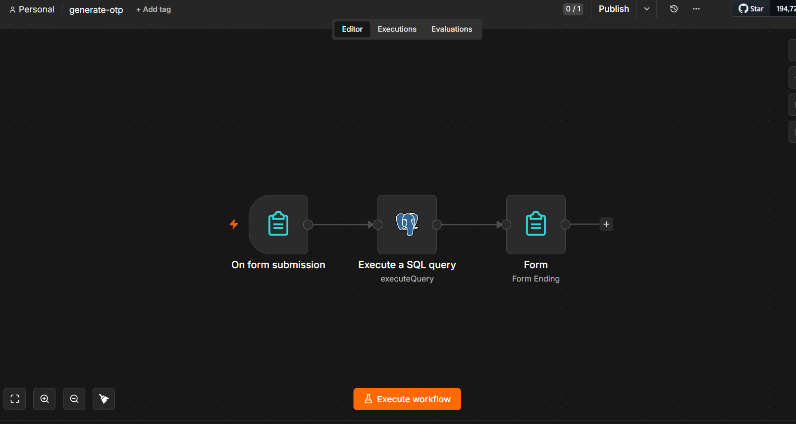
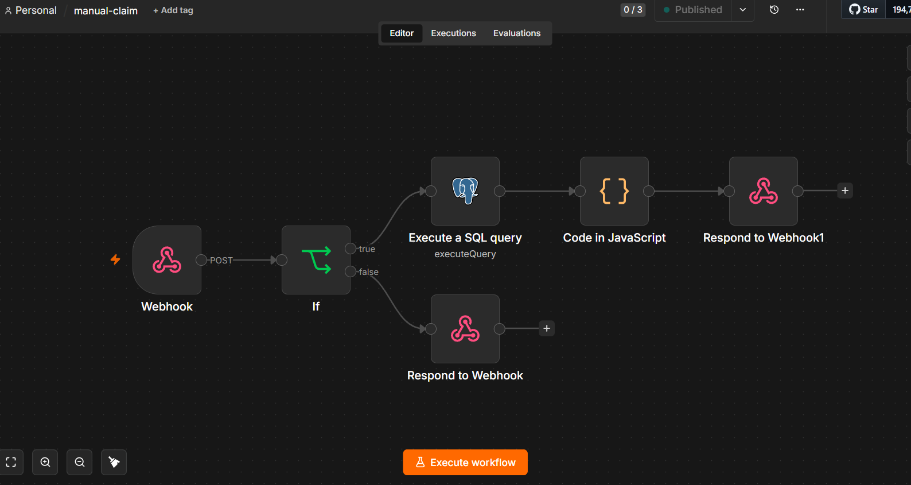
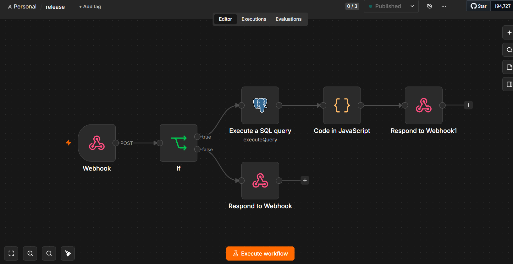
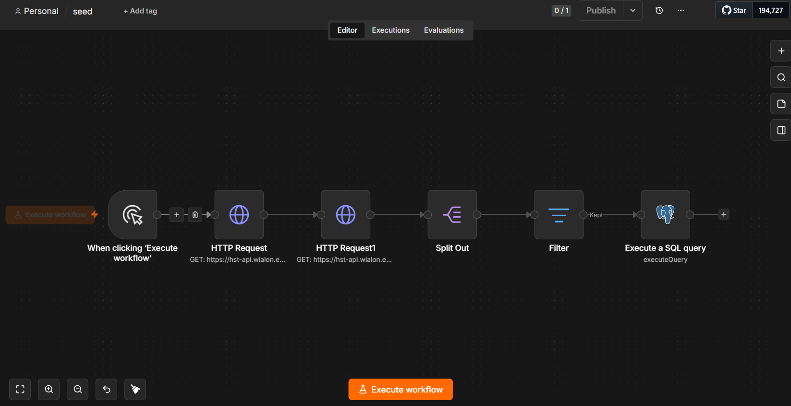

# Build the Admin Backend — full process (n8n + Postgres)

How the provisioning/admin backend is built from zero to a working, phone-verified state.
Two paths:
- **Path A (fast):** import the ready workflow JSONs (`provisioning/n8n/workflows/*.json`) and fill in
  secrets. Skip to §7.
- **Path B (from scratch):** build every workflow node-by-node — this is the full process below.

Reference: `README.md` (runbook), `LOCAL-RUN.md` (bring-up), `CONFIG_REFERENCE.md` (config cheat sheet).

---

## 0. Prerequisites
- Docker Desktop
- A Postgres database — Neon (cloud) or a local `postgres:16` container
- `psql` client
- `curl` (testing), and `cloudflared` or `adb` (to reach the phone)
- **n8n ≥ 2.27** (see §0.1 — the form workflows need a recent n8n)

Set a shell var for the DB (never commit it):
```
PROV_DB_URL="postgresql://<user>:<pass>@<host>:5432/neondb"   # Neon needs sslmode=require
```

## 0.1 n8n version & node compatibility (read this before importing)
These workflows were exported from **n8n 2.27.5**. Two things regularly trip up a
first import on someone else's n8n:

**A) Node version — the "On form submission" error.** The form workflows use the
**Form Trigger** node **typeVersion 2.6** (and Form / completion **2.5**, Postgres
**2.6**). On an **older n8n** the imported form node shows:
> *"Install this node to use it — This node is not currently installed. It is
> either from a newer version of n8n, a custom node, or has an invalid structure."*

That is **not a config error — your n8n is too old.** Node versions used:

| Node | typeVersion | Used by |
|---|---|---|
| `formTrigger` (On form submission) | **2.6** | `generate-otp` |
| `form` (completion) | **2.5** | `generate-otp` |
| `postgres` | **2.6** | all |
| `webhook` | 2.1 | `manual-claim`, `release` |
| `if` | 2.3 | `manual-claim`, `release` |

Fix — pick one:
- **Update your n8n** to ≥ 2.27 (recommended) → re-import → everything loads as-is.
- **Or keep your n8n and rebuild the form node by hand:** delete the broken
  *On form submission* node, add a **fresh** one from your own node panel (it uses
  *your* version), set its **Form Title / Description / Fields** to match §4, and
  reconnect it → Postgres → Form (completion). The **webhook** workflows
  (`manual-claim`, `release`, `seed`) don't use the form node and import fine on
  older n8n.

**B) Credentials do NOT import.** n8n strips credentials from exported JSON by
design. Every imported Postgres node arrives with **no credential attached** (a
red warning) referencing an id that exists only on the exporter's instance. You
must **create your own Postgres credential** (§3) and **select it on each Postgres
node** before the workflow can run. Likewise the `<HAMS_CLAIM_SECRET>` and
`<WIALON_TOKEN>` placeholders are yours to fill in.

Also make sure the **SQL functions exist in the DB you point at** (§1) — a valid
credential still errors with *"function issue_otp does not exist"* if the schema
was never applied.

## 1. Apply the SQL (functions live in Postgres, not n8n)
The security/guard/OTP logic is plpgsql so the n8n workflows stay thin.
```
psql "$PROV_DB_URL" -f provisioning/sql/001_units.sql          # units table
psql "$PROV_DB_URL" -f provisioning/sql/003_seed_unit.sql      # seed_unit(uid,name) UPSERT
psql "$PROV_DB_URL" -f provisioning/sql/004_admin_otp.sql      # admin_otp + issue/valid/consume
psql "$PROV_DB_URL" -f provisioning/sql/005_manual_provision.sql  # manual_claim, release_unit
```
Sanity check (a bad OTP must be rejected, no unit touched):
```
psql "$PROV_DB_URL" -c "SELECT manual_claim('HAMS_TEST_001','fp-x','000000');"
-- expect {"status":"admin_auth_failed"}
```

## 2. Start n8n
```
docker run -d --name hams-n8n -p 5678:5678 -v n8n_data:/home/node/.n8n n8nio/n8n
```
Open `http://localhost:5678`, create the owner account. (Data persists in volume `n8n_data`.)

## 3. Create the Postgres credential (once, reused by every workflow)
n8n → Credentials → **Postgres**. Name it `Postgres account`. Fill host / db / user / password / port.
Two gotchas that cost us time:
- **No leading/trailing space in the Host field** (a stray space → "host not found").
- **SSL = Require** for Neon (mandatory) — default "Disable" fails to connect.
Click **Test** → must be green before continuing.

## 4. Workflow `generate-otp` (admin issues a supervisor code)



```
Form Trigger  (title "Generate Supervisor OTP"; optional Number field "minutes")
  → Postgres (Execute Query, cred "Postgres account"):
        SELECT issue_otp(10) AS otp;
  → Form Ending
        Completion Message  (Expression mode):  Code: {{ $json.otp }} — valid ~10 min, single use.
```
Open the form's Test URL → submit → the completion page shows a 6-digit code. Done.

## 5. Workflow `manual-claim` (device binds a unit)  — POST webhook



```
Webhook  (HTTP Method POST, Path "manual-claim", Authentication None,
          Respond = "Using 'Respond to Webhook' Node")
  → IF   {{ $json.headers['x-hams-key'] }}  ==  <HAMS_CLAIM_SECRET>
       false → Respond to Webhook:  Response Code 401,  body {"error":"unauthorized"}
       true  → Postgres (Execute Query):
                   SELECT manual_claim($1,$2,$3) AS result;
                   Query Parameters (Expression):
                     {{ $json.body.unique_id }}, {{ $json.body.fingerprint }}, {{ $json.headers['x-hams-admin-passkey'] }}
             → Code node (map SQL status → HTTP, JS below)
             → Respond to Webhook:  Respond With JSON,
                   Response Body (Expression) {{ $json.body }},
                   Options → Response Code (Expression) {{ $json.code }}
```
Code node (Run Once for All Items):
```js
const r = $json.result; const s = r.status; let code=200, body=r;
if (s==='ok') { code=200; body={unique_id:r.unique_id}; }
else if (s==='admin_auth_failed') { code=401; body={error:s}; }
else if (s==='fingerprint_in_use') { code=409; body={error:s, on:r.on}; }
else if (s==='already_bound') { code=409; body={error:s}; }
else if (s==='not_found') { code=404; body={error:s}; }
else { code=400; body={error:s||'bad_request'}; }
return [{ json: { code, body } }];
```

## 6. Workflow `release` (device releases its unit) — POST webhook



Identical shape to `manual-claim`, three changes:
- Webhook Path = `release`
- Postgres query: `SELECT release_unit($1,$2,$3) AS result;` (same 3 params)
- Code node mapping:
```js
const r = $json.result; const s = r.status; let code=200, body=r;
if (s==='ok') { code=200; body={ok:true}; }
else if (s==='admin_auth_failed') { code=401; body={error:s}; }
else if (s==='not_owner_or_not_found') { code=409; body={error:s}; }
else { code=400; body={error:s||'bad_request'}; }
return [{ json: { code, body } }];
```

## 7. Publish the webhooks (n8n 2.x)
Webhooks are **not live until Published**. Open `manual-claim` and `release` → **Publish**.
- Production URL = `http://localhost:5678/webhook/<path>` (test URL is `/webhook-test/<path>`).
- The `Respond to Webhook` node only works if the Webhook node's Respond = "Using Respond to Webhook Node".
- If you imported the JSONs (Path A): set the IF node key to your real `HAMS_CLAIM_SECRET`, select the
  Postgres credential on each node, then Publish. **If a node shows "install this node" or an empty
  credential, see §0.1** — that's the n8n-version / credentials-don't-import gotcha, not a bug.

## 8. Workflow `seed` (pull Wialon units → Postgres) — Manual trigger



Host: `https://hst-api.wialon.eu/wialon/ajax.html`
```
Manual Trigger
  → HTTP Request GET "login":  Send Query Parameters ON
        svc = token/login
        params = {"token":"<WIALON_TOKEN>"}         <-- token MUST be JSON-quoted (see gotcha)
     -> response has  eid
  → HTTP Request GET "search":
        svc = core/search_items
        params = {"spec":{"itemsType":"avl_unit","propName":"sys_name","propValueMask":"*","sortType":"sys_name"},"force":1,"flags":257,"from":0,"to":0}
        sid = {{ $json.eid }}
     -> response has  items[]
  → Split Out  (Field To Split Out: items)
  → Filter  (Boolean is true, Expression):
        {{ /^(HAMS_|TEST_HAMS_APP_)/.test($json.nm) && String($json.uid || '').trim() !== '' }}
  → Postgres (Execute Query):  SELECT seed_unit($1, $2);
        Query Parameters:  {{ $json.uid }}, {{ $json.nm }}
```
Click **Test workflow** to run. `seed_unit` UPSERTs the name only — never touches `claimed` /
`device_fingerprint`, so re-runs are safe. `flags=257` (`0x1`|`0x100`) is the lean flag that exposes
`items[].uid` (the IPS unique id) + `items[].nm`.

## 9. Test the webhooks (curl)
```
OTP=$(psql "$PROV_DB_URL" -t -A -c "SELECT issue_otp(10);")
BASE=http://localhost:5678         # or the tunnel URL

# happy path (200)
curl -s -X POST $BASE/webhook/manual-claim \
  -H "Content-Type: application/json" -H "x-hams-key: <HAMS_CLAIM_SECRET>" -H "x-hams-admin-passkey: $OTP" \
  -d '{"unique_id":"HAMS_TEST_001","fingerprint":"test-fp"}'
```
Full matrix (each with a fresh OTP where needed): used/expired OTP → 401 `admin_auth_failed`;
wrong `x-hams-key` → 401 `unauthorized`; this device owns another unit → 409 `fingerprint_in_use`;
target owned by another device → 409 `already_bound`; unknown unit → 404 `not_found`;
release by owner → 200 `{ok:true}`; release by non-owner → 409 `not_owner_or_not_found`.

## 10. Expose to the phone + point the app
`targetSdk 35` blocks plain HTTP to non-loopback hosts. Either:
- **USB:** `adb reverse tcp:5678 tcp:5678` → use `http://127.0.0.1:5678/...` (loopback is allowed by
  `app/src/main/res/xml/network_security_config.xml`).
- **Untethered:** `cloudflared tunnel --url http://localhost:5678` → use the `https://…` URL.
  (Quick-tunnel hostnames are ephemeral — re-point on every restart.)

Then in `local.properties`:
```
MANUAL_CLAIM_URL=<base>/webhook/manual-claim
RELEASE_URL=<base>/webhook/release
HAMS_CLAIM_SECRET=<same value as the IF node>
```
`.\gradlew.bat :app:installDebug` → on the phone's PairingScreen enter a unit id + an OTP → Pair.
Confirm: `psql "$PROV_DB_URL" -c "SELECT unique_id, device_fingerprint, claimed FROM units ORDER BY unique_id;"`

---

## Gotchas we actually hit (read these before debugging)
1. **Wialon login returns `error 4 WRONG_PARAMS`** → the token wasn't JSON-quoted. Must be
   `{"token":"<value>"}`, not `{"token":<value>}`.
2. **Postgres "host not found"** → a stray leading space in the credential Host field. Re-type it.
3. **Postgres won't connect (Neon)** → SSL was "Disable"; set it to **Require**.
4. **Webhook returns nothing / 404** → workflow not **Published**, or you hit the `/webhook-test/` URL
   instead of `/webhook/`.
5. **`Respond to Webhook` does nothing** → the Webhook node's Respond isn't set to
   "Using Respond to Webhook Node".
6. **OTP rejected on a valid-looking code** → it's single-use and expires (~10 min); mint a fresh one.
   OTP is consumed only on a *successful* bind/release, so a failed guard never burns it.
7. **After PC sleep** → Docker stops. `docker start hams-n8n`, confirm `curl localhost:5678/healthz` = 200.

## Security notes
- The workflow JSONs in `provisioning/n8n/workflows/` have secrets replaced by placeholders
  (`<HAMS_CLAIM_SECRET>`, `<WIALON_TOKEN>`) — re-enter the real values after importing; never commit them.
- Real secrets live only in `local.properties` and inside the n8n credential/node fields.

---
**Nav:** [🏠 Hub](../README.md) · [Setup](../SETUP.md) · [provisioning/](README.md) · [Config](../CONFIG_REFERENCE.md) · [Tests](../TEST_CASES.md)
